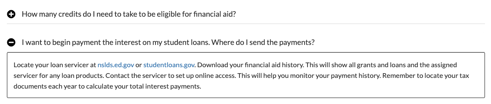

# Collapse Text
The [Collapse Text](https://www.drupal.org/project/collapse_text) module is used extensively throughout all CU websites to provide grouped grouped pieces of information in a easily digestible fashion.

This is what the final result looks like:

## Using Collapse Text
Simply place `[collapsed]` at the beginning of the block of the text that you want to collapse, and place `[\collapse]` at the end of the block of text. Ensure that a header (H2 through H6) is present right after the first `[collapsed]` tag, as the module automatically sets a header as the title of the collapsed block.

If you want the collapsable block expanded when the user first visits the page, use `[collapse]` as the first tag.

The Collapse Text module has been configured to work on Basic HTML and Full HTML text formats.