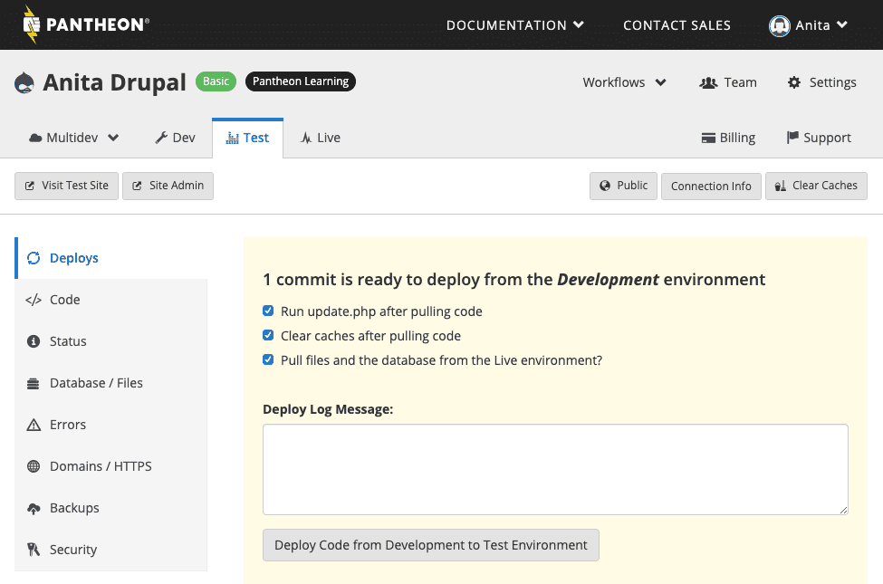

# The Pantheon Workflow
Pantheon is the hosting provider for all our Drupal websites. Being a developer-oriented product, there is a specific workflow built into the Pantheon system that must be followed.

There are three environments inside Pantheon:
* Dev, for developing code.
* Test, to review and perform quality assurance before taking new code live. Sometimes called Staging.
* Live, where only tested and functional code is allowed. Sometimes called Prod or Production.

## Workflow Visualization
In this workflow, code is pushed up from Dev to Test to Live, and content is cloned down from Live. The Live environment is where all the content gets created.

## Making Code Updates
Anytime that you update a module, theme, or core, you are making code updates. These always start by making the change locally and pushing the change to the site through Git. Once it’s pushed, it’s always a good idea to test the site to make sure it works as intended, and to make any other code updates if necessary. Once the changes have been committed to Dev and you’re ready to test the changes fully, you can switch to Test and deploy the updates from Dev.

On Test, there are several checkbox options. It’s usually a good idea to check all three of these. However, if the code update is minor (like changing a couple of CSS lines) and if the database was recently updates on Test, it’s ok to uncheck the **Pull files and database from the Live environment?** option.

Due to Drupal’s extreme caching, after making any updates you’ll need to clear the cache. This step is bundled when deploying, provided the checkbox is selected.

## Making Content Updates
Content updates are always made in Live — this includes file uploads. Simply log into the front end of the website (the URL follows the pattern sitedomain.com/user) and make any desired changes. Every so often it’s a good idea to clone the Live database into Test and Dev for added backups and comprehensive testing when deploying code changes.
## Further Reading
For further reading, check out these resources.
* [Use the Pantheon WebOps Workflow | Pantheon Docs](https://pantheon.io/docs/pantheon-workflow)
* [Dev/Test/Live | Pantheon](https://pantheon.io/agencies/development-workflow/dev-test-live-workflow)
* [Version Control & Workflow | Pantheon](https://pantheon.io/features/version-control-workflow)